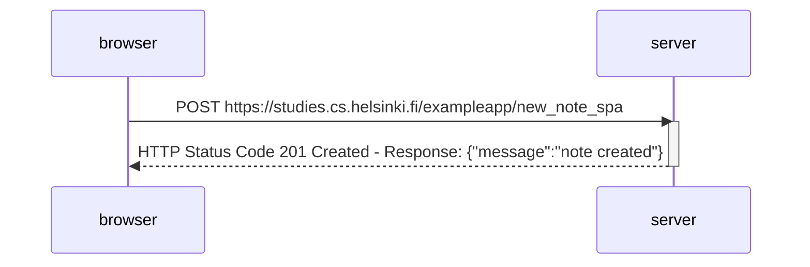

The user types "ABC" in the text box and then submit

```mermaid
sequenceDiagram
    participant browser
    participant server

    browser->>server: POST https://studies.cs.helsinki.fi/exampleapp/new_note_spa
    activate server
    server-->>browser: HTTP Status Code 201 Created - Response: {"message":"note created"}
    deactivate server
```